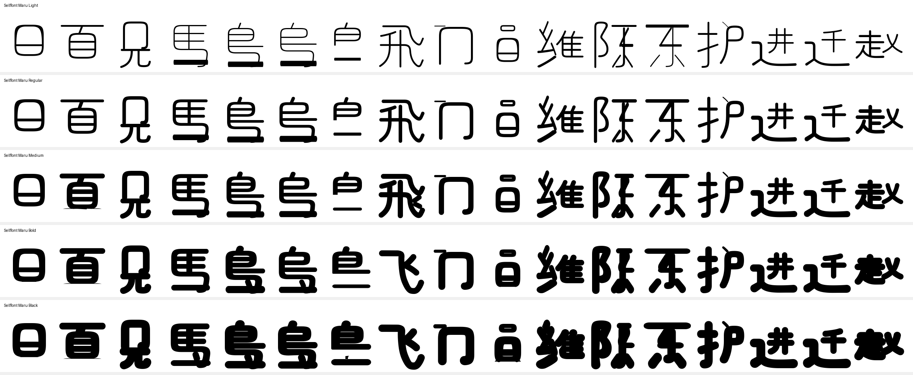
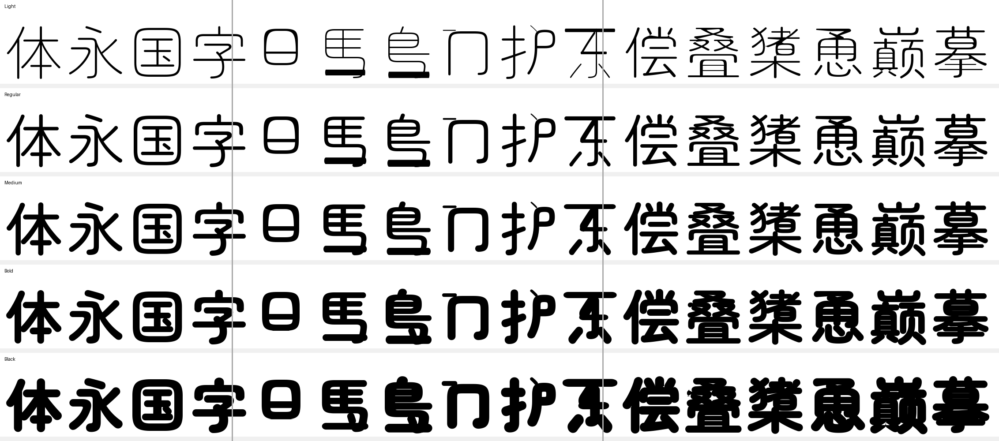

# 简体扩展：先用自己的笔画拼，拼不出的向参考字体借

Zen Maru 是日文字体，简体专用字形缺失。实测它只画了 GB2312 的 **3378/6763** 个汉字，缺 3385 个。`tools/extend_font.py` 分两层补：

1. **自己的轮廓和笔画**：能拼的字（贝/页/马/鸟/门/东/陈/护/见/员/维/飞…）用它**自己已有的轮廓和笔画**拼出来——不描摹，不做路径手术，也不做几何美化。
2. **可审计的参考字体**：规则够不到的字，从 `config/reference-sources.json` 里钉死的参考源借轮廓——版本、字节数、SHA-256、许可、保留字体名都写死在仓库里，借入逐字记进报告，并按**本字重的实测厚度**缩放。

结果：五个字重都是 **GB2312 6763/6763**；目标表里的 44 个字全部有字形，其中 14 个练习缺字全部由自家规则画出（`飞` 的 Bold/Black 例外，见下）。

## 规则怎么写的

一条规则 = 一个新字 → 若干 `(源字, 选择器, 造形器)`：

```python
recipe("马", ("馬", all_contours, body_only), ("一", all_contours, bar_over_feet()))
```

- **选择器按角色挑轮廓**，从不使用轮廓序号——五个字重各自绘制，同一个字在 Light 有 6 个轮廓、Bold 只有 4 个。常用的是：`main_contour`（主体）、`everything_but_main`（孔和脚）、`left_half` / `right_half`（部件在中心线哪一侧）、`left_radical` / `right_radical`（占满大半高度、贴着某一侧的部件）、`highest` / `except_highest`、`above_main`、`leftmost` / `rightmost`。
- **造形器**把选中的轮廓变成新字的轮廓：`fit`（放进一个盒子）、`translate`、`then`（依次施加）、`flip_x`、`frame`、`without_feet`、`simplified_box`、`without_feathers`、`bar_over_feet`。
- **镜像/翻转要反绕向**：TrueType 靠绕向决定实心还是挖空。镜像会把绕向一起翻过来，于是「框」变「洞」；`Contour.reversed()` 把镜像出来的副本倒回来（门 曾经渲染成两个实心块，就是这个原因）。
- **空选择不是「什么都没选」**：`everything_but_main` 可以是空的（Bold 的 飛 就是一条合并的轮廓），标了 `optional`；别的选择器选空 = 这个字重证不出这条规则 → **报错并跳过**，而不是产出一个少一条胳膊的字。



## 14 个缺字各自的手法

| 字 | 来源 | 手法 |
|---|---|---|
| 贝 页 | 貝 頁 | 去掉 灬 脚（分开的轮廓直接丢；并入主体的按主体自己的地板线切开），再把最下面两个白槽合并成一格 |
| 马 鸟 乌 岛 | 馬 鳥 烏 島 | 同一条规则：去脚 + 底横。底横轮廓取自 一，放进脚原来占的那条带子里；岛 的 鳥 本来就画得比 鳥 小，不去缩它 |
| 门 | 冂 戸 | 门 = 冂（这个字体自己就有冂）+ 左上一点，点取 戸 的顶横压扁 |
| 见 | 冂 元 | 见 = 冂 + 儿（取 元 的主体轮廓，那正是儿的两条腿） |
| 员 | 員 | 員 上面的口（连同白槽）+ 下面按 贝 同样简化过的貝 |
| 维 | 幺 糸 隹 | 幺 的两折就是纟的两折；糸 的左下点本身就是「提」的走向，正好当纟的第三笔；右边放 隹 |
| 陈 | 限 + 东 | 阝 取自 限（陳 的字重里阝 会和右件并成一条轮廓，那样选出来的是碎片，规则会拒绝），右边是**重新排布的 东** |
| 护 | 打 所 丶 | 扌 取自 打；户 = 所 的左件（戶 = 尸 + 顶上那一笔）去掉顶横，再补 丶 当点——丶 的斜向就是 户 第一笔的斜向 |
| 进 迁 | 辻 井 / 辻 千 | 辻 已有 辶（轮廓 0），换掉被包的部分 |
| 赵 | 走 乂 | 走 + 乂 缩放拼合 |
| 飞 | 飛 | 去掉四根小羽（Light/Regular/Medium；Bold/Black 把羽毛并进主体，跳过） |

**规则够不到时**：`飞` 的 Bold/Black 把四根羽毛并进了主体轮廓，选不出来，硬切就是猜。这两个字重由下面的参考字体补上——报告里照实记 `skipped`（规则跳过）与 `origin: reference`（实际来源）。

## 东：拿笔画拼，而不是把 東 缩小

简体 东 不是「東 挖掉一块」：它没有 日 的右壁和内横，两脚变成点。这个引擎不做路径手术（切一条轮廓里的某几段），所以 东 是**用这个字体自己的单笔画拼的**——这个字体把单笔画也画成了字：`一` `丨` `亅` `丿` `丶`，还有片假名 `ニ`（两条不同长的横）和 `冫`（一点一提）：

```python
recipe("东", ("一", all_contours, fit((55, 730, 945, 800), keep_aspect=False)),   # 上横
             ("冫", highest, then(flip_x(), fit((330, 340, 600, 745), keep_aspect=False))),  # 撇折的撇
             ("ニ", highest, fit((330, 340, 800, 400), keep_aspect=False)),         # 撇折的折
             ("亅", all_contours, fit((450, -75, 640, 800))),                      # 竖钩
             ("冫", highest, then(flip_x(), fit((140, -75, 360, 190), keep_aspect=False))),  # 左下点
             ("冫", highest, fit((640, -75, 860, 190), keep_aspect=False)))         # 右下点
```

为什么是「拼」而不是「缩」：**这个字体的笔画粗细不随部件宽窄变化**（一 63、丨 63、亅 62、丿 61、丶 65、小 的点 58~64、彡 59——都是同一个笔重）。把 東 整体等比压进 陈 的右列，笔画会跟着变细（60 → 36），和旁边的 阝 明显不搭；所以 陈 的右件是同样的笔画**按右列的宽度重新排布**，不是缩小的 东：

```python
recipe("陈", ("限", left_radical, fit((60, -90, 430, 850))),
            ("ニ", highest, fit((450, 736, 960, 801))),
            ...同样的笔画，放在 x 450~960 这一列里)
```

（`东` 这个字本身也顺手有了：它在目标表里没提，但做 陈 的过程中就齐了。）

## 每个派生字都要回到这个字重

把部件缩进一个盒子，笔画会跟着缩：实测 赵 只有本字重笔画的 **0.51**、见 0.60、维 0.59、进 0.66、员 0.67——一排里明显比旁边的字轻，而这个字体没有"更轻的笔画"（同字等粗）。所以规则跑完、存盘之前，引擎会**逐字量厚度**（墨面积 ÷ 轮廓周长），偏离本面基准超过 12% 的沿法线偏移回基准，偏移量与前后比值都写进报告：

| 字 | 修前/本面 | 修后/本面 |
|---|---|---|
| 赵 | 0.51 | 0.99 |
| 维 | 0.59 | 0.99 |
| 见 | 0.60 | 0.98 |
| 进 迁 | 0.66 0.67 | 0.98 0.99 |
| 员 | 0.67 | 0.99 |
| 门 | 0.79 | 0.98 |
| 飞 | 0.86 | 0.99 |

（五个字重跑完，规则字最差也有 0.95，不再是 0.51。）

推不动的字（偏移会把轮廓翻面或压塌）：有参考字体时**换用参考的那一笔**并在报告里注明 `replacedRecipe` 与原因；没有参考时**报出来**而不是发一个轻一笔的字。

## 参考字体：借可以，但必须可审计、且按字重缩放

`config/reference-sources.json` 是唯一的参考源登记表，一条记录钉住项目、发布版本、文件、字节数、**SHA-256**、许可、保留字体名（RFN）以及它自己基于什么。工具在打开参考文件前核对字节数与 SHA-256，不符即拒（`UnpinnedReference`）；许可全文随仓库放在 `licenses/`。

当前参考是**寒蝉半圆体 ChillRoundM v1.805**（`Warren2060/ChillRound`，OFL-1.1，保留字体名 `ChillRoundF`/`ChillRoundM`，本身基于 Zen Maru Gothic 调整）：骨架与圆角风格同源，且对 3385 个缺字**全部**有真轮廓。（早期 ChillRoundM 版本对这批字是空占位，所以版本与哈希必须钉死；`build/reference/` 只放副本，不入 Git。）

两条规矩：

- **规则优先**：规则先跑，参考只补"这个面还没有的码点"。同一码点在通过校验时就地占位，所以绝不会出现一个字被写两遍（这条断言抓出过真实 bug：参考流程曾把规则派生过的字又借了一遍，留下 `uni8D1D.1` 这种不可达重复字形）。
- **字重要对得上**：参考只有一个字重（400），本字体有五档。借入时先量两面在共有探针字上的"墨面积 ÷ 轮廓周长"厚度比（Light 0.44 → Black 1.72），再沿轮廓法线做 miter 偏移（正数 = 加墨：实体外扩、字腔收缩），初始值取厚度差的一半，然后**量一次、修正一次**迭代到目标厚度（±0.5 单位）。会把轮廓翻面、压塌（面积趋零）或甩出画布的偏移**自动退让**（折半；尖角 miter 上限 4 倍偏移量），退让多少逐字记进报告；单字轮廓跑出 ±1400 单位盒子外 → 拒绝该字并如实记录。

结果：借入字形"达成厚度 ÷ 目标厚度"的中位数 0.98–1.04，**100% 落在目标 ±25% 内**；轮廓坐标审计 0 字越出 1200 单位。



（图：左 = Zen Maru 原生，中 = 自家规则派生，右 = 参考借入。三段的字重变化是同步的。）

## 跑法

```sh
python3 tools/prepare_font.py --font-dir <Zen Maru 的 5 个 TTF>   # -> build/fonts
# 可选：把钉死的参考文件放到 build/reference/（工具会核对 SHA-256）
python3 tools/extend_font.py --reference chillroundm --charset gb2312   # -> build/fonts-simplified
python3 tools/extend_font.py --reference chillroundm --charset targets  # 只补目标字表那一小批
python3 tools/extend_font.py                                    # 不带参考：只做自家规则
python3 tools/edit_font.py                                      # -> build/fonts-patched
python3 tools/glyph_audit.py --font-dir build/fonts-patched     # 目标字表现况
python3 tools/make_extension_sheet.py                           # 重画文档里那张图
python3 tools/build_module.py --base build/base/MFGA-base.zip
```

## 工具怎么保证没干坏事

- 新字必须是**已有轮廓的仿射组合**；引擎不产生新点，也不改点，更不做路径手术。
- 保存前逐字断言：原有每个字形**逐字节不变**、字形顺序不变、cmap 只多出这次派生出来的码点。
- 派生字已存在（面里本来就有）→ 报错拒绝覆盖。
- 某个字重证不出这条规则 → **跳过并写进报告**，不产出猜测形状；缺字在手机上回退系统字体，比一个坏字形安全。
- 度量（`hmtx`/`vmtx`）取来源字形的中位数；借入字直接沿用参考字形的 advance，不外造。
- 保存后断言"写进字体的新字形名集合 == 这次准备写的名字"（防止同一码点写两遍），并且 cmap 的增量**正好**等于本次派生的码点。
- 借入字在报告里带 `origin: reference`、`sourceGlyph`、偏移量与前后厚度（`thickness`、`targetThickness`、必要时 `offsetBackoff`）；自家派生的字没有 `origin`，一眼分得清。
- 规则字带 `weightBefore` / `weightAfter` / `offsetToFaceWeight`（回到本字重的过程），被参考替换的还带 `replacedRecipe` 与 `reason`。
- **存盘前不许有空字形**：`TTGlyphPen.glyph()` 会把画笔清空，量一个、再存第二个就会存进一个空轮廓（屏幕上是豆腐块）。归一化时量到的对象就是存下的对象，这条有专项测试。

## 覆盖情况

| | Zen Maru 原生 | 加上规则与借入 |
|---|---|---|
| GB2312 汉字 | 3378/6763 | **6763/6763**（五个字重） |
| 目标表 44 字 | 缺 14 个简体形 | 44/44（12 个练习字由规则画，`飞` 的 Bold/Black 由参考补） |
| 每字重自绘 | — | 规则 17 + 参考 3368（Bold/Black 3369） |

## 顺序与手写笔画

手写笔画 patch（`config/glyph-patches/`）作用在**派生之后**的面上：prepare → extend → edit。`tools/edit_font.py` 的默认输入已经是 `build/fonts-simplified`，输出 `build/fonts-patched`。

patch 里的点是按**钉住的原始面**（`config/base-source.json` 里的 sha256）的轮廓下标写的，所以 edit 阶段会比对哈希：一旦它编辑的不是那张钉住的面，就打印一条 notice——「这次编辑的是派生面，下标必须对得上这张面真正画的那个字形」。
